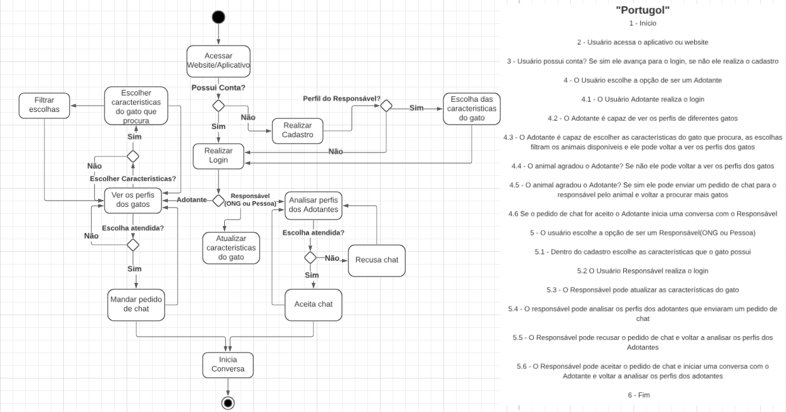

# 🐾 Trabalho de Modelagem de Software - "MiauDote"

Este repositório contém o trabalho desenvolvido na UC de **Modelagem de Software**, cujo objetivo foi modelar o funcionamento de um sistema de adoção de gatos.  

---

## 📌 Objetivo do Projeto
O sistema "MiauDote" busca conectar **adotantes** e **responsáveis (ONGs ou pessoas)** de forma simples e organizada, permitindo que ambos tenham acesso às informações necessárias para realizar o processo de adoção com segurança e transparência.

---

## 📊 Fluxograma do Sistema
O fluxograma representa o **fluxo principal** do sistema, desde o acesso ao aplicativo/site até a comunicação entre adotantes e responsáveis.

### Principais Etapas do Fluxo:
- **Adotante**:
  - Acessa o sistema, realiza login ou cadastro.
  - Escolhe características desejadas do gato ou visualiza perfis.
  - Envia pedido de chat ao responsável pelo animal.
  - Inicia conversa caso o pedido seja aceito.

- **Responsável (ONG ou Pessoa)**:
  - Realiza login ou cadastro.
  - Atualiza características do gato.
  - Analisa pedidos de chat recebidos dos adotantes.
  - Pode aceitar ou recusar os pedidos de conversa.
    
Além do fluxograma, o processo foi detalhado em **pseudocódigo em Portugol**, descrevendo passo a passo as interações do usuário (adotante e responsável) com o sistema.

---

## 🚀 Tecnologias e Conceitos Envolvidos
- **Modelagem de Software**
- **Fluxogramas**
- **Pseudocódigo (Portugol)**
- **Engenharia de Requisitos**
- **Casos de Uso** (implícitos no processo modelado)

---

## 📂 Estrutura do Repositório
- `miaudote.png` → Fluxograma do sistema
  
---

https://ruddy-politician-b1d.notion.site/A3-Governan-a-e-Projetos-265df6f285d3805db139fcf1f3e8ad6e?source=copy_link
trabalho sendo re estruturado na ud de governança e processsos

https://www.notion.so/Miaudote-267e9594710c807f9a44c7be6e5aee85
